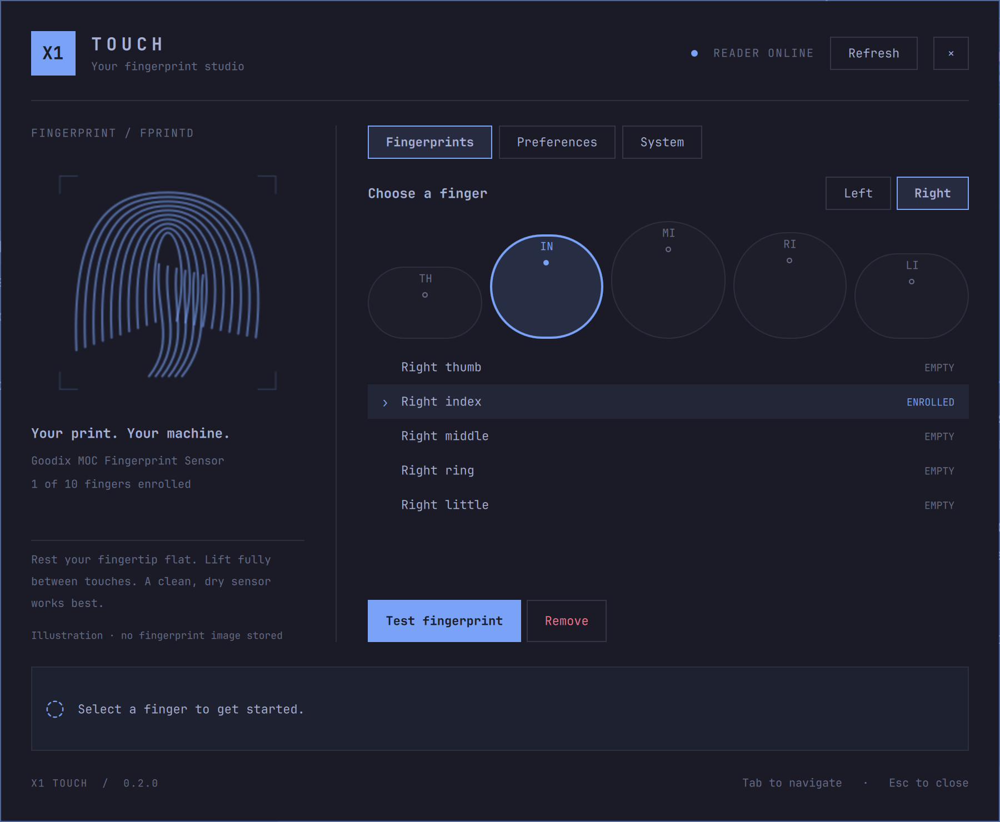

# X1 Touch

A fingerprint studio for **Omarchy with fprintd-compatible readers**. Built as a
native Quickshell panel and bar widget, it follows the active Omarchy palette,
font, spacing and corners. Originally developed on a ThinkPad X1; the name and
plugin ID remain stable for existing installations.



## What it does

- Shows the current user's enrolled fingers in a visual left/right selector.
- Enrolls a new finger with live stage counts and placement feedback.
- Tests a specific enrolled finger with match, retry and timeout feedback.
- Removes one selected finger after an explicit confirmation.
- Offers configurable test/enrollment timeouts, animation, hints and default hand.
- Shows hardware, driver versions and detected sudo/Polkit/lock configuration.
- Supports keyboard focus with Tab, activation with Enter/Space, and Escape to
  cancel a scan or close the panel. Closing the panel releases its reader claim.
- Adds an application launcher and a fingerprint button on the Omarchy bar.

The fingerprint drawing is an illustration. The plugin receives status events
from fprintd, not fingerprint images, templates, confidence scores or passwords.
Enrollment progress counts successful stages reported by the reader. The test
progress line represents elapsed time, not fingerprint quality.

## Requirements

- Omarchy 4.x with the Quickshell plugin system (developed on 4.0.4).
- One reader exposed by fprintd, with a working driver for its exact hardware ID.
- Existing working `fprintd` and `libfprint`/`libfprint-git` installation.
- `/usr/bin/python`, `python-gobject`, GTK/GLib introspection, and `pacman`.
- Active desktop session with a Polkit authentication agent (Omarchy provides it).

This project uses the existing driver. It does not flash firmware, replace
libfprint, install an authentication service, or rewrite PAM. Discovery uses
fprintd rather than a USB/vendor whitelist, so it also accommodates SPI readers
when exposed by the driver. If multiple readers are exposed, it refuses to guess
which one owns an enrollment: only one reader at a time is currently supported.
Older fprintd versions without single-finger deletion report an unsupported
operation; the plugin never falls back to deleting every enrollment.

## Hardware compatibility

Compatibility depends on the installed libfprint driver, firmware, and fprintd.
This is not a claim to support every fingerprint reader or every ThinkPad X1.
The UI displays the detected name and press/swipe scan method; it does not infer
a USB ID or match-on-chip capability from the laptop model.

| Hardware | Sensor | Validation status |
| --- | --- | --- |
| Our X1 Carbon Gen 14 | Goodix `27c6:659c` | Live discovery, listing, scan start, timeout and cancellation checked; successful physical matching/enrollment still pending |
| Reported X1 Carbon Gen 13 | Goodix `27c6:658c` | Listed upstream; not physically tested with this plugin |
| Reported X1 Carbon Gen 12 | Synaptics `06cb:0123` | Listed upstream; not physically tested with this plugin |
| Other fprintd-compatible readers | Driver-dependent | General discovery and press/swipe behavior covered with simulated readers; physical testing required |

Sources: [Gen 13 hardware log](https://github.com/wheaney/breezy-desktop/issues/165),
[Gen 12 hardware log](https://github.com/fwupd/fwupd/issues/7180), and
[libfprint supported devices](https://fprint.freedesktop.org/supported-devices.html).
The upstream list covers the **development version**; distribution releases may
lag behind it. The hardware reports describe particular units, not every SKU.

## Install

With the supported reader already working through fprintd:

```bash
omarchy pkg add fprintd python-gobject
omarchy plugin add https://github.com/Dandiccf/omarchy-x1-touch --enable
```

Click the fingerprint bar icon to open the studio. To also add an application
launcher entry, run this optional command after installation:

```bash
/usr/bin/python ~/.config/omarchy/plugins/io.github.dandiccf.x1-touch/scripts/install.py launcher
```

Launcher setup creates files only at absent paths and leaves existing files or
symlinks alone. Removal deletes only regular files matching the installer’s
exact generated content and ownership marker. Legacy 0.1.0 launcher files are
left in place; they still launch the same plugin ID.

Plugin ID: `io.github.dandiccf.x1-touch`. The plugin does not install or replace
your fingerprint driver. This release has automated tests and live
hardware timeout/cancellation validation; see [validation status](VALIDATION.md)
for physical enrollment and matching checks still to be completed.

## Install from a development checkout

From this project checkout:

```bash
/usr/bin/python scripts/install.py install
```

This copies a validated plugin to `~/.config/omarchy/plugins/io.github.dandiccf.x1-touch`,
registers the launcher, and enables the bar widget. Updating with the same
command saves the previous plugin in `~/.local/state/x1-touch/install-backups/`.
It requires no sudo. Keep the project checkout as the editable source.
If a plugin update retains an old layout in memory, run `omarchy restart shell`
once after closing any active scan; this refreshes the shell’s QML cache.

Open **X1 Touch** in the application launcher, click the fingerprint bar icon, or:

```bash
omarchy-shell shell summon io.github.dandiccf.x1-touch '{}'
```

Marketplace installs are ordinary Git checkouts and can be updated with
`omarchy plugin update io.github.dandiccf.x1-touch`. The local development
installer copies files instead; it intentionally does not copy Git metadata.

## Use

Select a hand and finger. A filled dot means an enrollment exists for your
current Linux account. Empty fingers offer **Enroll fingerprint**; registered
fingers offer **Test fingerprint** and **Remove**. Enrollment never silently
replaces an existing entry. Removing a finger is permanent and requires a new
enrollment to restore it. There is no bulk-clear action.

For enrollment, approve the system authorization dialog if it appears, then
press or swipe as instructed and fully lift your finger between stages. The panel displays the actual
stage count reported by fprintd. You can cancel at any time. A completed
enrollment remains saved even if you close the panel immediately afterwards.
The driver and fprintd own incomplete-enrollment cleanup and sensor storage.

The list covers the current Linux user's registrations known to fprintd. It is
not an inventory of other users' or Windows Hello's sensor entries.

Preferences are stored atomically with mode `0600` in
`~/.config/x1-touch/settings.json` (XDG paths are respected). Scan timeouts apply
only to this plugin; they do not alter sudo or the lock screen's timeout.
Authentication badges report directly configured `pam_fprintd.so` lines, not
successful authentication tests or recursive PAM-stack analysis.

## Terminal interface

```bash
/usr/bin/python backend/fingerprint.py status
/usr/bin/python backend/fingerprint.py verify --finger right-index-finger
/usr/bin/python backend/fingerprint.py enroll --finger left-index-finger
```

Output is newline-delimited JSON. Operates only as the current user, using
fprintd's empty-username convention. Deletion additionally requires
`--confirm-finger` to match `--finger`. The helper does not bypass Polkit.

## Development and checks

```bash
bash scripts/check.sh
```

Tests cover generic discovery, no/multiple/disconnected readers, swipe feedback,
launcher ownership and symlinks, input validation, configuration persistence,
enrollment progress, duplicate-enrollment refusal, confirmation requirements,
match/failure, timeout, cancellation and reader release. These tests use a fake
fprintd client and never add or remove fingerprints on real hardware.

`backend/model.py` owns pure validation/state. `backend/fingerprint.py` is the
Gio D-Bus bridge. `Controller.qml` consumes its JSON events. `Panel.qml` and
`components/` contain the native themed UI. There is no always-on polling daemon;
status refreshes when the panel opens, after an operation, or on Refresh.

See [VALIDATION.md](VALIDATION.md) for the checks performed on the target laptop.

Before release, manually test an enrollment with a spare finger, successful
verification, cancellation, per-finger deletion, Polkit denial, busy reader,
sleep/resume, and a small/high-DPI screen. Successful matching and enrollment
require a person's physical touch and cannot be established by unit tests.

API reference: [fprintd Device interface](https://fprint.freedesktop.org/fprintd-dev/Device.html).
Shell contract: `/usr/share/omarchy/shell/README.md` on the target system.

## Remove

From the installed plugin or a source checkout:

```bash
/usr/bin/python ~/.config/omarchy/plugins/io.github.dandiccf.x1-touch/scripts/install.py uninstall --yes
```

This removes the plugin, launcher and icon. Existing fingerprints, authentication
configuration and your preferences are retained.

If you did not register the optional launcher, `omarchy plugin remove
io.github.dandiccf.x1-touch` also removes the standard plugin checkout.

## License

MIT. Original implementation; no T480 project driver or code is bundled.
